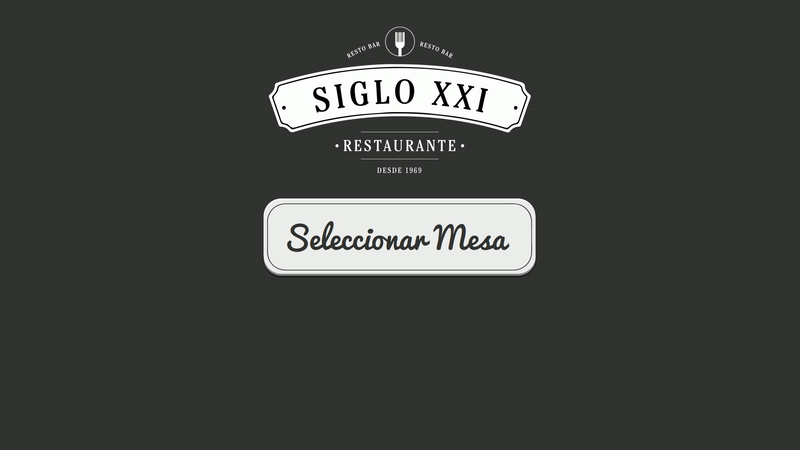
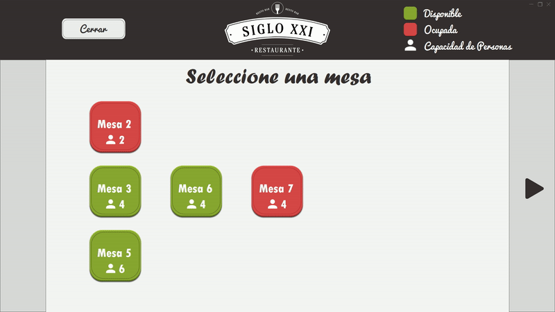

# Proyecto-de-Titulo-Restaurante-Siglo-XXI-TOTEM

Rest API CLIENT

Desarrollado en <b>C#</b>, usando el framework .NET con Windows Forms 

La aplicación está destinada a ser utilizada en un totem, con el objetivo de que los <b>nuevos clientes</b> que llegan al restaurante puedan elegir una de las <b>mesas disponibles</b>. 

Al seleccionar una mesa esta misma cambia su estado para quedar como "Ocupada" y solo volverá a estar "Disponible" cuando el cliente realice el pago en caja o cuando el administrador del restaurante libere la mesa desde su propia interfaz.

Los datos se obtienen realizando consultas internas a un servicio REST API
y dependiendo de las mesas obtenidas en la consulta se generan nuevos botones con caracteristicas dinamicas, cada boton generado dinamicamente posee un nombre, capacidad y evento distinto

Solo se enseñan las mesas que tienen asignadas un garzón. 

Al apretar "Seleccionar Mesa" se actualizan las mesas con garzones asignados 

<b> En este ejemplo hay 5 mesas asignadas a garzones y una mesa ya ocupada (Mesa 2)

<b> Al seleccionar una mesa aparecerá un ventana de confirmación y al aceptar se enseña una nueva pantalla informando al usuario que la mesa ha sido seleccionada con exito y puede dirigirse a ella

La aplicación esta preparada para recibir una cantidad ilimitada de mesas en la consulta y así generar todas las mesas que puedan ser necesarias por el restaurante (se pueden generar infinitos botones).
*posible bug-fix* que solo se pueda mover la interfaz dependiendo de la cantidad de mesas 
  

